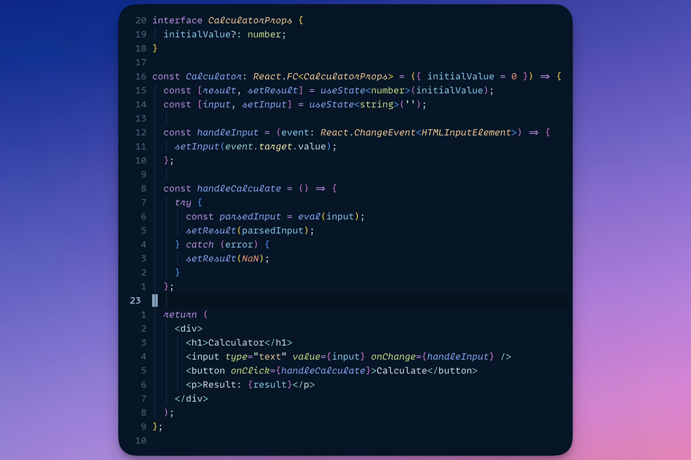

<div align="center">
    <h1>🦉 night-owl.nvim 🌌</h1>
</div>

<div align="center">
    
</div>

The _best_ implementation of
[Sarah Drasner's Night Owl VSCode theme](https://github.com/sdras/night-owl-vscode-theme)
for Neovim with Treesitter support.



## 📦 How to install

### Packer

```lua
use("oxfist/night-owl.nvim")
```

### vim-plug

```vim
Plug 'oxfist/night-owl.nvim'
```

## 🚀 Usage

Add the following line to your Lua configuration files:

```lua
vim.cmd.colorscheme("night-owl")
```

## 🔎 Comparison

How does this port compare to the original VSCode theme? Check it out!

| Original VSCode Theme                                                        | This Theme 🤩                                                              |
| ---------------------------------------------------------------------------- | -------------------------------------------------------------------------- |
|  |  |

## ✨ Features

This implementation of Night Owl solves several syntax highlight discrepancies
that other ports have with the original VSCode theme.

The following features allow making the programming experience as close to the
original VSCode theme as possible:

1. Additional Treesitter queries to extend the default highlight groups (see
   [`after/queries`](./after/queries))
2. Autocommands to enable changing background colors when Neovim is inactive
   (see [`after/plugin/autocmds.lua`](./after/plugin/autocmds.lua))

<details>
    <summary>👇 Click to see comparison with <code>haishanh/night-owl.vim</code></summary>

| [haishanh/night-owl.vim](https://github.com/haishanh/night-owl.vim)             | This Theme                                                                 |
| ------------------------------------------------------------------------------- | -------------------------------------------------------------------------- |
|  |  |

With Treesitter installed you can see the overall look and feel is significantly
different:

- Different colors for several keywords like `let`, `const`, `async`,
  `function`, etc. Same happens for class names `EditFishForm` and `Sale`.
- Italics _not_ applied anywhere except for comments.
- Italics _incorrectly_ applied to JSDoc keywords `@param` and `@returns`.
  <br />

</details>

### Language Support 🌐

I've personally reviewed these languages extensively enough to consider they
look _acceptable_ for me to invite you to use this colorscheme if you build
software with them.

<!-- <style> -->
<!-- .languages { -->
<!--     background-color: none; -->
<!-- } -->
<!---->
<!-- .languages tr { -->
<!--     display: flex; -->
<!-- } -->
<!---->
<!-- .languages td { -->
<!--     display: flex; -->
<!--     justify-content: center; -->
<!--     align-items: center; -->
<!--     width: 7em; -->
<!--     height: 7em; -->
<!-- } -->
<!---->
<!-- .todo { -->
<!--     filter: grayscale(100%) blur(2px); -->
<!-- } -->
<!---->
<!-- .supported { -->
<!--     width: 3.5em; -->
<!-- } -->
<!-- </style> -->
<!---->
<!-- <table class="languages"> -->
<!--   <tr> -->
<!--     <td></td> -->
<!--     <td></td> -->
<!--     <td></td> -->
<!--     <td></td> -->
<!--     <td></td> -->
<!--   </tr> -->
<!--   <tr> -->
<!--     <td></td> -->
<!--     <td></td> -->
<!--     <td></td> -->
<!--     <td></td> -->
<!--     <td></td> -->
<!--   </tr> -->
<!-- </table> -->

<table>
  <tr>
    <td></td>
    <td></td>
    <td></td>
    <td></td>
    <!-- <td></td> -->
  </tr>
  <!-- <tr> -->
  <!--   <td></td> -->
  <!--   <td></td> -->
  <!--   <td></td> -->
  <!--   <td></td> -->
  <!--   <td></td> -->
  <!-- </tr> -->
</table>

Coming Soon: Lua, Vimscript, Rust, Python, Ruby.

## 🧩 Plugins Supported

- [Treesitter](https://github.com/nvim-treesitter/nvim-treesitter)
- [NvimTree](https://github.com/nvim-tree/nvim-tree.lua)
