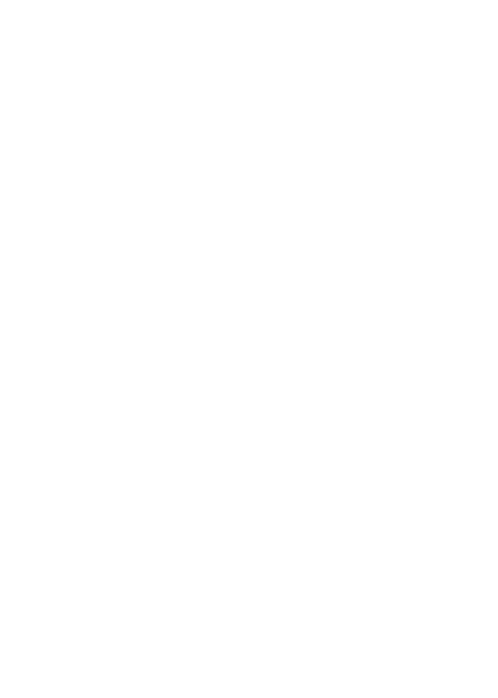
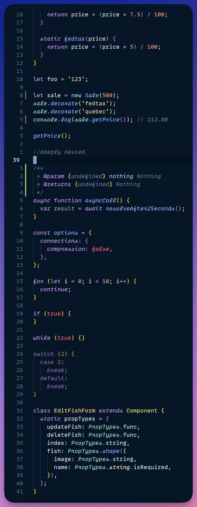
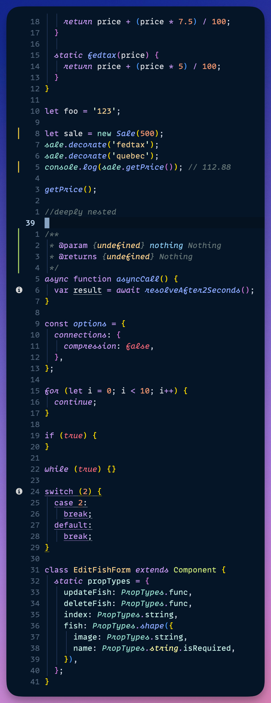
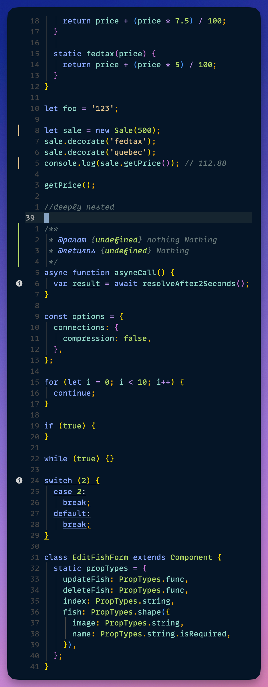

<div align="center">
    <h1>🦉 night-owl.nvim 🌌</h1>
    <a href="#contributors">
        </img>
    </a>
</div>
<div align="center">
    <picture>
        <source media="(prefers-color-scheme: dark)" srcset="https://raw.githubusercontent.com/oxfist/night-owl.nvim/main/img/light_logo.png" alt="Illustration of an owl">
        <source media="(prefers-color-scheme: light)" srcset="https://raw.githubusercontent.com/oxfist/night-owl.nvim/main/img/dark_logo.png" alt="Illustration of an owl">
        
    </picture>
</div>

The _best_ implementation of
[Sarah Drasner's Night Owl VSCode theme](https://github.com/sdras/night-owl-vscode-theme)
for Neovim with support for Tree-sitter and semantic tokens.

## 📦 Install In Zero Time

### packer.nvim

```lua
use("oxfist/night-owl.nvim")
```

### lazy.nvim

```lua
require("lazy").setup({
  "oxfist/night-owl.nvim",
  lazy = false, -- make sure we load this during startup if it is your main colorscheme
  priority = 1000, -- make sure to load this before all the other start plugins
  config = function()
    -- load the colorscheme here
    vim.cmd.colorscheme("night-owl")
  end,
})
```

### vim-plug

```vim
Plug 'oxfist/night-owl.nvim'
```

## 🚀 Start Using With A Single Line

<!-- prettier-ignore-start -->
> [!NOTE]
> You can skip this step if you followed the `lazy.nvim` setup, since that
> already sets the colorscheme.
<!-- prettier-ignore-end -->

Add the following line to your Lua configuration files, e.g.
`~/.config/nvim/init.lua` (your actual path might be different):

```lua
vim.cmd.colorscheme("night-owl")
```

Or by requiring the plugin, then calling `setup()`:

```lua
require("night-owl").setup()
```

To enable `night-owl` for `lualine.nvim`, simply set the theme like this in your
settings 👇:

```lua
-- This Lualine config should be somewhere in your config files
require('lualine').setup {
  options = {
    -- ... other configs
    theme = 'night-owl'
    -- ... other configs
  }
}
```

## ⚙️ Configuration

The styling of the theme can be customized by calling `setup()`:

```lua
local night_owl = require("night-owl")

-- 👇 Add your own personal settings here
--@param options Config|nil
night_owl.setup({
    -- These are the default settings
    bold = true,
    italics = true,
    underline = true,
    undercurl = true,
:   transparent_background = false,
})
```

## 🖥️ Requirements

TODO

## 🔎 Comparison

How does this port compare to the original VSCode theme? Check it out!

| Original Night Owl for VSCode                                                | This Theme 🤩                                                              |
| ---------------------------------------------------------------------------- | -------------------------------------------------------------------------- |
|  |  |

## ✨ Why Should You Pick _This_ Version of Night Owl?

This implementation of Night Owl solves several syntax highlight issues and
discrepancies similar ports have when comparing to the original VSCode theme.

The following features allow making the programming experience as close to the
original VSCode theme as possible:

1. **Extended highlight groups**: through additional Treesitter queries. See
   [`after/queries`](./after/queries) for implementation details.
2. **Different background color when Neovim is inactive**: through autocommands.
   See [`after/plugin/autocmds.lua`](./after/plugin/autocmds.lua) for
   implementation details.

<details>
<summary>👇 Click to see comparison with <code>haishanh/night-owl.vim</code></summary>

With Treesitter installed you can see the overall look and feel is significantly
different:

- Different colors for several keywords like `let`, `const`, `async`,
  `function`, etc. Same happens for class names `EditFishForm` and `Sale`.
- Italics _not_ applied anywhere except for comments.
- Italics _incorrectly_ applied to JSDoc keywords `@param` and `@returns`.
  <br />

| [haishanh/night-owl.vim](https://github.com/haishanh/night-owl.vim)             | This Theme                                                                 |
| ------------------------------------------------------------------------------- | -------------------------------------------------------------------------- |
|  |  |

</details>

### Language Support 🌐

<table>
  <tr>
    <td></td>
    <td></td>
    <td></td>
    <td></td>
    <td></td>
  </tr>
  <!-- <tr> -->
  <!--   <td></td> -->
  <!--   <td></td> -->
  <!--   <td></td> -->
  <!--   <td></td> -->
  <!--   <td></td> -->
  <!-- </tr> -->
</table>

<!-- prettier-ignore-start -->
> [!NOTE]
> I've personally optimized the colorscheme styling and robustness for these
> languages extensively enough to confidently say they look _acceptable_ to me.
> If you happen to build software with them, then I invite you to try out this
> theme! 🙂
<!-- prettier-ignore-end -->

**Coming Soon**: Lua ✅, Vimscript (in progress), TSX, R, Rust, Python, Ruby,
Bash, and many more!

## 🧩 Plugins Supported

- [nvim-treesitter](https://github.com/nvim-treesitter/nvim-treesitter)
- [nvim-tree](https://github.com/nvim-tree/nvim-tree.lua)
- [lualine.nvim](https://github.com/nvim-lualine/lualine.nvim)
- [indent-blankline.nvim](https://github.com/lukas-reineke/indent-blankline.nvim)
  `v2` and `v3`
- [toggleterm.nvim](https://github.com/akinsho/toggleterm.nvim)
- [gitsigns.nvim](https://github.com/lewis6991/gitsigns.nvim)

## 🎇 Credits

- [Sarah Drasner](https://github.com/sdras) first and foremost, for creating
  such a beautiful and artistic color scheme that has made, for me personally,
  so much more _pleasurable_ the exhilirating act of building software.
- <https://www.monolisa.dev/> for one of the sweetest programming fonts out
  there.
- [Christian Chiarulli](https://github.com/ChristianChiarulli) for creating
  [`colorgen-nvim`](https://github.com/LunarVim/colorgen-nvim), an essential
  tool that helped me get started with this implementation.

## Code of Conduct

- [`CODE_OF_CONDUCT.md`](./CODE_OF_CONDUCT.md)

## License

- [`LICENSE`](./LICENSE)

## Contributors

<!-- ALL-CONTRIBUTORS-LIST:START - Do not remove or modify this section -->
<!-- prettier-ignore-start -->
<!-- markdownlint-disable -->
<table>
  <tbody>
    <tr>
      <td align="center" valign="top" width="14.28%"><a href="https://github.com/oxfist"><br /><sub><b>Andrés Quilodrán</b></sub></a></td>
      <td align="center" valign="top" width="14.28%"><a href="https://github.com/dmnkgrc"><br /><sub><b>Dominik Garcia</b></sub></a></td>
      <td align="center" valign="top" width="14.28%"><a href="https://github.com/nanyaDev"><br /><sub><b>Rish</b></sub></a></td>
      <td align="center" valign="top" width="14.28%"><a href="https://www.lampeweb.de"><br /><sub><b>Michael Lazarski</b></sub></a></td>
      <td align="center" valign="top" width="14.28%"><a href="https://denisw.de"><br /><sub><b>Denis Washington</b></sub></a></td>
      <td align="center" valign="top" width="14.28%"><a href="https://github.com/kmlopez-hhl"><br /><sub><b>kmlopez-hhl</b></sub></a></td>
      <td align="center" valign="top" width="14.28%"><a href="https://github.com/Benson9954029"><br /><sub><b>Benson9954029</b></sub></a></td>
    </tr>
    <tr>
      <td align="center" valign="top" width="14.28%"><a href="https://github.com/gnoeyp"><br /><sub><b>Silver Hong</b></sub></a></td>
      <td align="center" valign="top" width="14.28%"><a href="https://github.com/sebvilhelm"><br /><sub><b>Sebastian Vilhelm Juhl</b></sub></a></td>
      <td align="center" valign="top" width="14.28%"><a href="https://github.com/jdsprink91"><br /><sub><b>Jason Sprinkle</b></sub></a></td>
      <td align="center" valign="top" width="14.28%"><a href="https://github.com/bendk"><br /><sub><b>bendk</b></sub></a></td>
      <td align="center" valign="top" width="14.28%"><a href="https://github.com/gokayburuc"><br /><sub><b>Gökay BÜRÜÇ</b></sub></a></td>
    </tr>
  </tbody>
</table>

<!-- markdownlint-restore -->
<!-- prettier-ignore-end -->

<!-- ALL-CONTRIBUTORS-LIST:END -->
